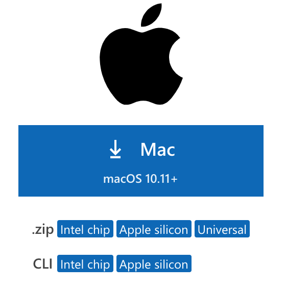

## Creating your CSE15L account

1) Click on the following link: https://sdacs.ucsd.edu/~icc/index.php
2) Enter your ucsd username and PID in the respective boxes: 
3) You must reset your password by entering your current password and a new one: 
4) Once that is done you have created a new CSE 15L account

## How to install VS code:
1) Click on the link: https://code.visualstudio.com/download
2) Once you are on the page and if you are using a MAC, click on this install icon: 

## How to remotely connect
1) Open a terminal in VS code after installing it. (Use the shortcut keys Control + `). 
2) Once the terminal is open type in the command:ssh cs15lwi23zz@ieng6.ucsd.edu. The 'zz' must be replaced by the characters given in your username while creating the account. Press enter
3) You'll see a message that says this: The authenticity of host 'ieng6.ucsd.edu (128.54.70.227)' can't be established.
RSA key fingerprint is SHA256:ksruYwhnYH+sySHnHAtLUHngrPEyZTDl/1x99wUQcec.
Are you sure you want to continue connecting (yes/no/[fingerprint])? 
Type in 'yes'.
4) After this you'll be asked to type in the password that you created. 

## Writing comands in VS code
cd ~
cd
ls -lat
ls -a

