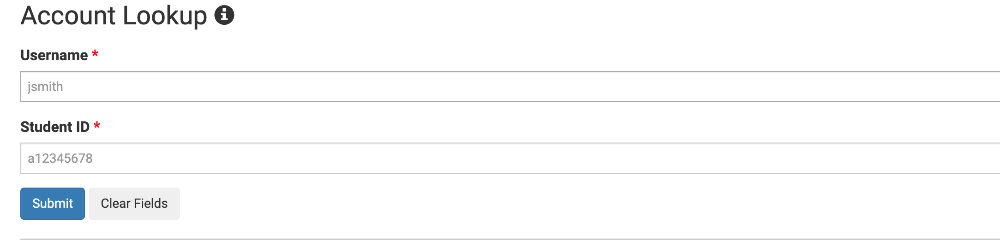

Creating your CSE15L account

1) Click on the following link: https://sdacs.ucsd.edu/~icc/index.php
2) Enter your ucsd username and PID in the respective boxes: 
3) You must reset your password by entering your current password and a new one: 
4) Once that is done you have created a new CSE 15L account

