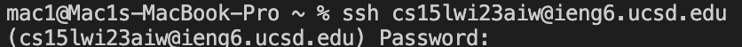
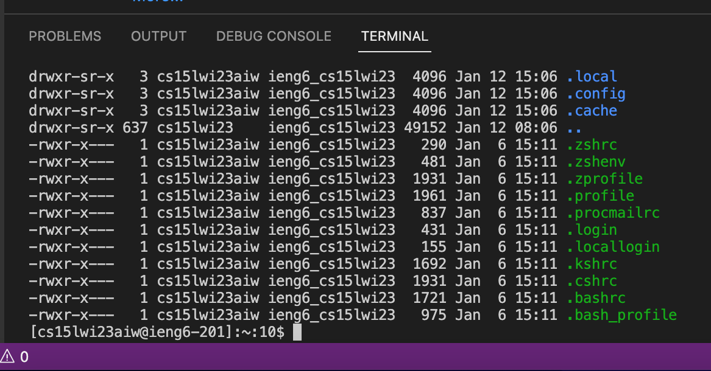
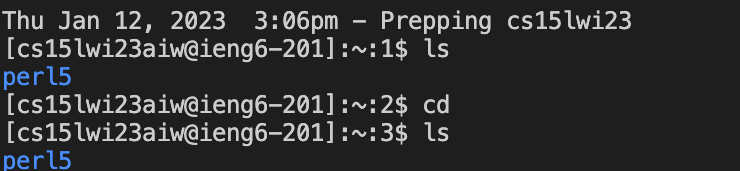

## Creating your CSE15L account

1) Click on the following link: https://sdacs.ucsd.edu/~icc/index.php
2) Enter your ucsd username and PID in the respective boxes: 
3) You must reset your password by entering your current password and a new one: 
4) Once that is done you have created a new CSE 15L account

## How to install VS code:
1) Click on the link: https://code.visualstudio.com/download
2) Once you are on the page and if you are using a MAC, click on this install icon: 
3) If you are using a Windows device click on this install icon: 

## How to remotely connect
1) Open a terminal in VS code after installing it. (Use the shortcut keys Control + `). 
2) Once the terminal is open type in the command:ssh cs15lwi23zz@ieng6.ucsd.edu. 
3) The 'zz' must be replaced by the characters given in your username while creating the account.
4) Press enter. 
5) VS Code should look something like this:  
6) You'll see a message that says this: The authenticity of host 'ieng6.ucsd.edu (128.54.70.227)' can't be established.
RSA key fingerprint is SHA256:ksruYwhnYH+sySHnHAtLUHngrPEyZTDl/1x99wUQcec.
Are you sure you want to continue connecting (yes/no/[fingerprint])? 
6) Type in 'yes'.
7) After this you'll be asked to type in the password that you created. 
8) So what has happened? You are now connected to a computer situated in the basement of the CSE building.
9) This Computer is your 'server'.

## Writing comands in VS code

1) You must type in the commands into the VS code terminal
2) cd~
3) cd
4) ls -lat
5) ls -a 
6) /home/linux/ieng6/cs15lwi23/cs15lwi23abc ( replace the abc with alphabets given in your group member's account name)
7) After testing all this commands note the output that each one produces. 
* For example the command ls -lat should give a similar result: 

Here are some more examples of commands utilized: 
1) The commands ls and cd have been called. 
2) ls stands for list
3) cd stands for change directory
4) This is what it looks like in VS code: 
5) To exit the server, you must type in 'exit'.
