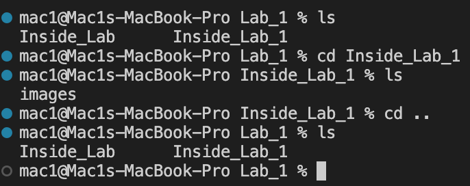

## Creating your CSE15L account

1) Click on the following link: https://sdacs.ucsd.edu/~icc/index.php
2) Enter your ucsd username and PID in the respective boxes:
3) You must reset your password by entering your current password and a new one:
4) Once that is done you have created a new CSE 15L account

## How to install VS code:
1) Click on the link: https://code.visualstudio.com/download
2) Once you are on the page and if you are using a MAC, click on this install icon:
3) If you are using a Windows device click on this install icon:

## How to remotely connect
1) Open a terminal in VS code after installing it. (Use the shortcut keys Control + `). 
2) Once the terminal is open type in the command:ssh cs15lwi23zz@ieng6.ucsd.edu. 
3) The 'zz' must be replaced by the characters given in your username while creating the account.
4) Press enter. 
5) VS Code should look something like this:   
6) You'll see a message that says this: The authenticity of host 'ieng6.ucsd.edu (128.54.70.227)' can't be established.
RSA key fingerprint is SHA256:ksruYwhnYH+sySHnHAtLUHngrPEyZTDl/1x99wUQcec.
Are you sure you want to continue connecting (yes/no/[fingerprint])? 
7) Type in 'yes'.
8) After this you'll be asked to type in the password that you created. 
9) So what has happened? You are now connected to a computer situated in the basement of the CSE building.
10) This Computer is your 'server'.

## Writing comands in VS code

1) You must type in the commands into the VS code terminal
```
1) cd~
2) cd
3) ls -lat
4) ls -a 
5) /home/linux/ieng6/cs15lwi23/cs15lwi23abc ( replace the abc with alphabets given in your group member's account name)
```
2) After testing all this commands note the output that each one produces. 
   * For example the command ls -lat should give a similar result: 

#### Here are some more examples of commands utilized: 
1) The commands ls and cd have been called. 

2) ls stands for list 
    * This lists all the files that are in the current working directory.

3) cd stands for change directory
    * This changes the current working directory. Typing the command ls right after changing the directory will list all the files in the new current working directory. You may notice that running the "ls"command produces different results this time. It is because each working directory will have different files. 
   * This is what you should observe if you open a folder on your desktop in VS code(your files will be different): 

4) This is what it looks like in VS code while connected to the server: 

5) To exit the server, you must type in 'exit'.

#### _Pointers:_
```
Try typing the command cd ~ (the function of cd ~ is to take you back to the home directory) and then type ls. 
```
