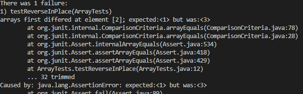

## Part 1: Lab Report 2
_Creating a String Server:_ 

1) This is what the code looks like: 
```   
String line = "";
    public String handleRequest(URI url) {


            if (url.getPath().contains("/add-message")) {
                String[] parameters = url.getQuery().split("=");
                if (parameters[0].equals("s")) {

                    line += (parameters[1] + "\n");
                    System.out.println("Path: " + url.getQuery());
                    return line;
                }
            }
            return "404 Not Found!";
        }
    }
 ```
 2) This is the result of adding messages:  
 3) Outcome after changing: 
 4) The methods that are called are: ".contains()", ".getQuery()",".split()", and ".equals()".
    * .contains checks if a particular String contains a particular segment.
    * The argument consists of the thing that is being compared, which is "/add-message". 
    * .getQuery is checking what s=xyz is being set to.
    * .split splits the path into two parts at the point where it finds an "="
    * argument consists of the String "="
    * .equals deep compares the two elements 
    * agument consists of "s"

5) The field that changes is the line field. A new string is concatenated so the value of the line variable changes.

## Part 2: Lab Report 2
_Testing JUnit_
* We are testing the reverseInPlace method. 

1) The inputs and their appropriate tests look like this:
```
@Test
public void testReverseInPlace(){
int[] input1 = {3};
int[] input2 = {1,2,3};
ArrayExamples.reverseInPlace(input1);
ArrayExamples.reverseInPlace(input2);
assertArrayEquals(new int[]{3}, input1);
assertArrayEquals(new int[]{3,2,1}, input2);
}
```

2) The output to these tests look like this: 
* 

3) This code causes error: 
```
static void reverseInPlace(int[] arr) {
    for(int i = 0; i < arr.length; i += 1) {
      arr[i] = arr[arr.length - i - 1];
    }
}
```
4) The code that needs to be written in order to run the test properly:
```
static void reverseInPlace(int[] arr){
    int [] newArray = new int[arr.length];
    for(int i = 0; i < arr.length; i++){
        newArray[i] = arr[arr.length - i - 1];
    }
    for(int i = 0; i < arr.length; i++){
        arr[i] = newArray[i];
    }
    return arr;
}
```
## Part 3: What have I learned?
_Learning_

1) I have learned how to create a s
