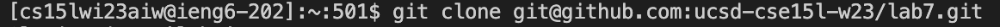
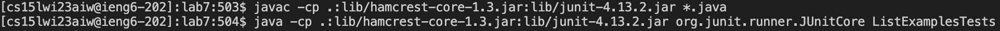
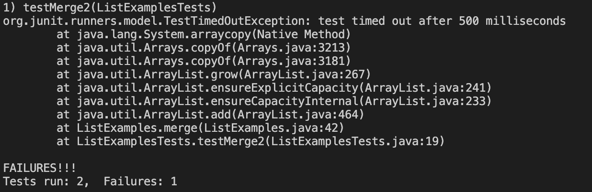
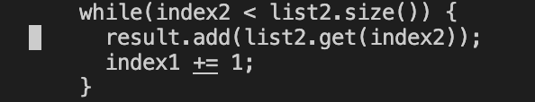
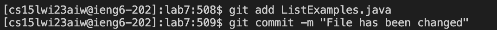
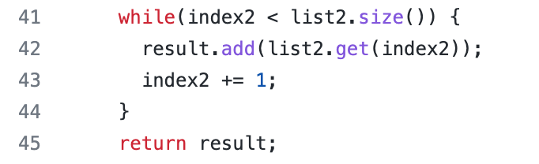

## Lab Report 4

### Logging into ieng6
  After completing the lab task once, I had to remove the respository
  from my directory.

  This required the command: 
  ```
  rm -r lab7
  ```

  After confirming the removal I restarted my lab task
  by logging into the ieng6 account:

  

#### Keys pressed: ```<up><enter>```
  
  After exiting the server, the ssh command was the first command
  to appear.

### Cloning 

  I cloned the repository using this command:
  
  
  ```
  git clone git@github.com:ramistry/lab7.git
  ```
  
  During the repetition of the lab task, I had to use the same
  command.
  
#### Keys pressed : ```<up><up><up><up><up><up><up><up><up><enter>```
  
  The cloning command was the second command to be executed after logging
  in, thus it required so many <up> commands
  
  Change directory to lab7.
  
  This required the command:
  ```
  cd lab7
  ```
#### Keys pressed: ```<up><up><up><up><up><up><up><up><up><up><enter>```
  
### Running the JUnit Tests
  
  This command was used twice during the first try, so I did not 
  have to press <up> till I reached the first command to run the test.
  Instead, I pressed it until I reached the step where I had to re-test
  the corrected code using the same JUnit commands.
  
  
  
  ```
  javac -cp .:lib/hamcrest-core-1.3.jar:lib/junit-4.13.2.jar *.java
  ```
  
#### Keys pressed: ```<up><up><up><up><up><up><up><up><enter>```
  
  This compiled the JUnit tests.
  I had to run the tests as well. 
  ```
  java -cp .:lib/hamcrest-core-1.3.jar:lib/junit-4.13.2.jar org.junit.runner.JUnitCore ListExamplesTests
  ```
  
#### Keys pressed: ```<up><up><up><up><up><up><up><up><enter>```
  
  The output showed two tests running, out of which one failed.
  
  
  
### Changing the code
  
  The command I used to change the code was:
  
  ```
  nano ListExamples.java
  ```
#### Keys pressed: ```<up><up><up><up><up><up><up><up><up><up><up><enter>```
  
  The code that was wrong was the final while loop:
  
  
  ```
    while(index2 < list2.size()) {
      result.add(list2.get(index2));
      index1 += 1;
    }
  ```
                                  
  
 This was was corrected to:
                               
 ```
    while(index2 < list2.size()) {
      result.add(list2.get(index2));
      index2 += 1;
    }   
  ```
  
  The commands that I used next did not show up in the bash history
  
  To save the edited file to disk:
  ```
  Ctrl-O
  ```
#### Keys pressed: ```<enter>```
  
  To exit from ``nano``: 
  
  ```
  Ctrl-X
  ```
  These two commands saved the changes made to the code and successfully left
  the command line text editor (nano).
  
  The two tests passed after that:
  

  
### Committing and Pushing
  
  The commands I used for these steps:
  
  ```
  git add ListExamples.java
  
  git commit -m "File has been changed"
  
  git push
  ```
  
  The first command ```git add ListExamples.java``` took:
  
#### Keys pressed: ```<up><up><up><up><up><up><up><enter>```
  
  The second command ```git commit -m "File has been changed"``` also took:
  
#### Keys pressed: ```<up><up><up><up><up><up><up><enter>```
  
  The third command took the same key presses:
  
#### Keys pressed: ```<up><up><up><up><up><up><up><enter>```
  
  These changes then showed up on the github repository that was forked.
  
  
  
  
  
  
